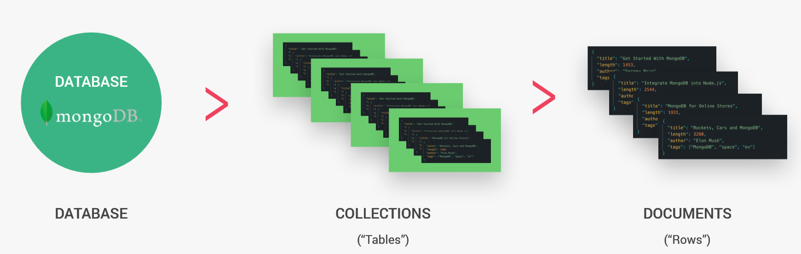
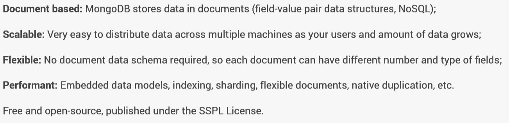
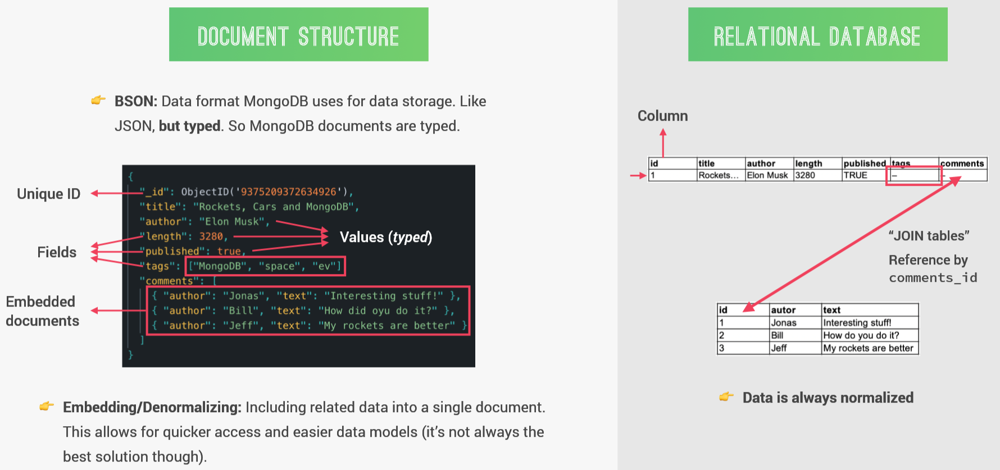

# MongoDB_Tutorial
  
**Key MongoDB Features:**



## Installing MongoDB on Windows
- run mongod.exe in cmd prompt located in  C:\Program Files\MongoDB\Server\4.2\bin - this will run the server
- run mongo shell mongo.exe in another cmd prompt located in C:\Program Files\MongoDB\Server\4.2\bin - for CRUD operations. this will connect to the server we just opened on the same port - 27017
- run db and see if the test database runs:
```
> db
test
>
```   
- close both cmd prompts - server and mongo shell with Ctrl+c
- ***to run the mongo server on a different directory***:  
  (the mongod.exe file comes from the bin directory); we need to look for this file in the bin directory by using **System variables**.  
  Go to Windows Setting -> in the search bar type in env and click on Edit system Environmental Variables -> **Environmental Variables** -> System variables - Path -> Edit -> Add mongoDB here; copy the bin directory for mongoDB; New -> past path here. -> OK  
  Now you can run mongo in any directory.  

## Creating a Local Database
- run server and mongo Shell (cls to clean the terminal)
- **use**command - will create or use the db
```
> use natours-test
switched to db natours-test
```
- create document inside a collection - **```> db.tours.insertMany()```**
- **insertMany()**method to create multiple documents; **insertOne()**method to insert one document
- insert a JavaScript object; this will be converted into JSON and later on to BSON.
```
> db.tours.insertOne({ name: "The Forest Hiker", price: 297, rating: 4.7 })
{
        "acknowledged" : true,
        "insertedId" : ObjectId("5db5c1031d3e30f64d200487")
}
>
```
- to check if the data is inserted: 
